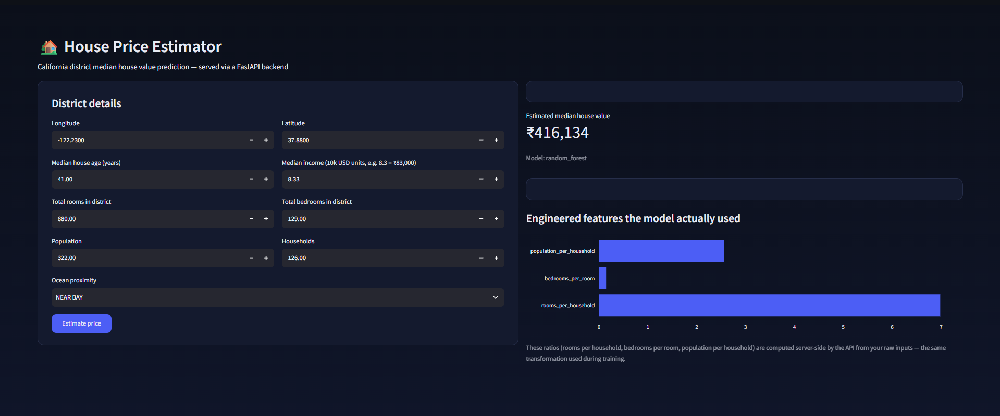
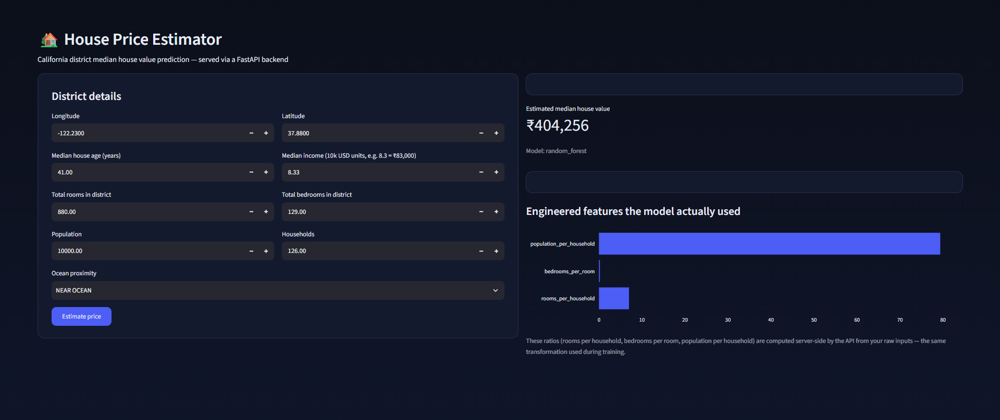
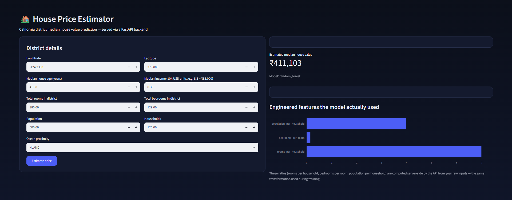

# Skyline-Real-Estate-House-Price-Estimator — API + Streamlit


**[Live Demo]([https://skyline-real-estate-house-price-estimator.streamlit.app/))**






## Project structure

```
house_price_predictor/
├── features.py            # shared feature engineering (train + serve)
├── train.py                # trains, evaluates, registers a new model version
├── model_registry.py         # versioned model storage + production promotion
├── monitoring.py               # logs predictions to SQLite, aggregates stats
├── api.py                        # FastAPI service — serves the production model
├── app.py                          # Streamlit UI — a CLIENT of the API, not a model host
├── Dockerfile.api
├── Dockerfile.streamlit
├── docker-compose.yml
├── requirements.txt
├── data/housing.csv                # real dataset (not committed, see below)
└── models/
    ├── registry.json                 # every trained version + its metrics
    ├── production.json                 # which version is currently live
    ├── monitoring.db                     # SQLite log of every prediction served
    └── versions/
        └── v1_.../
            ├── model.joblib
            └── metadata.json
```

## How to run it

### Locally (two terminals, no Docker)

```bash
pip install -r requirements.txt
curl -L "https://raw.githubusercontent.com/ageron/handson-ml2/master/datasets/housing/housing.csv" -o data/housing.csv
python3 train.py                              # trains + registers a model version

# terminal 1
uvicorn api:app --reload --port 8000
# docs at http://localhost:8000/docs

# terminal 2
streamlit run app.py
```

### With Docker Compose (one command, both services)

```bash
python3 train.py            # train at least once on the host first --
                             # the containers mount ./models, they don't train
docker compose up --build
```
API on `http://localhost:8000`, Streamlit on `http://localhost:8501`.
Retraining afterward on the host (`python3 train.py`) updates
`models/`, which the running API container picks up on its next
restart — no image rebuild needed, since the model artifacts are
mounted in rather than baked into the image.

## Results on this run

| Model | RMSE | MAE | R² |
|---|---|---|---|
| Linear Regression | ₹69,127 | ₹49,645 | 0.635 |
| **Random Forest (selected)** | **₹49,559** | **₹31,845** | **0.813** |
| Gradient Boosting | ₹51,808 | ₹35,154 | 0.795 |

Random Forest was selected automatically by `train.py` (lowest RMSE on
a held-out test set), then registered as `v1_...` and auto-promoted to
production. On average, predictions are off by about ₹32K. The saved
model is compressed (`joblib.dump(..., compress=3)`) and capped at
`min_samples_leaf=2` — an unconstrained version of this same model
came out to 166MB, over GitHub's 100MB file limit; this version is
~24MB with no meaningful accuracy loss.

---


## Request validation with Pydantic

`api.py` defines `HouseFeatures` as a Pydantic model with explicit
types and ranges (e.g. `longitude: float = Field(..., ge=-125,
le=-113)`). If a request sends `longitude: -200` or a string where a
number was expected, FastAPI rejects it with a `422` error and a
specific message — automatically, before any of your code runs.


## Auto-generated docs

Visiting `/docs` on the running API shows interactive Swagger
documentation — every endpoint, its expected request body, and a
"Try it out" button — generated entirely from the Pydantic models and
FastAPI route definitions, with zero docs written by hand. This is a
concrete, checkable artifact you can pull up live in an interview.

## Shared feature engineering, same as before

`features.py` is imported by both `train.py` and `api.py`, for the
same train/serve-skew reasons as the fraud detection project:
`rooms_per_household`, `bedrooms_per_room`, and
`population_per_household` are computed identically wherever they're
needed, from one function.

**Why these specific engineered features:** raw counts like
`total_rooms` describe a whole census district, not a single house —
a district with 2,000 total rooms could be 100 small houses or 20
large ones. Dividing by `households` turns that into a meaningful
per-house signal, which is why Random Forest performs meaningfully
better than Linear Regression on the raw features alone.

---

## Model registry and versioning

`train.py` no longer overwrites a single `house_price_model.joblib`.
Every run saves a new version under `models/versions/v{n}_{timestamp}/`
and appends an entry to `models/registry.json` with that version's
metrics. `model_registry.py` then decides whether to **promote** it:
if there's no production model yet, or if the new one beats the
current production model's RMSE, `models/production.json` is updated
to point at it. If not, the new version is still saved and logged —
just not served.


## Monitoring

Every call to `/predict` is timed and logged to
`models/monitoring.db` (SQLite) via `monitoring.py`: timestamp, which
model version served it, latency in milliseconds, the predicted price,
and the input. `/stats` aggregates this into request volume, average
latency, and the distribution of predicted prices.


## Docker

`Dockerfile.api` and `Dockerfile.streamlit` build the two services
separately and deliberately don't share a base layer with model code
they don't need — the Streamlit image never even copies
`features.py` or `model_registry.py`, since it never touches the model
directly. `docker-compose.yml` runs both together, on an internal
Docker network where the Streamlit container reaches the API by
service name (`http://api:8000`) rather than `localhost`.


## Honest limitations

- No authentication on the API — anyone who can reach it can call
  `/predict`. In production you'd add an API key or OAuth.
- `allow_origins=["*"]` in the CORS config is permissive by design for
  local development; a real deployment should restrict it to the
  actual frontend's domain.
- Monitoring logs outputs and latency, but not input feature
  distributions — no automated drift detection yet, as noted above.
- The model registry lives on local disk (mounted into Docker via a
  volume); a real multi-server deployment would need it backed by
  shared/cloud storage instead, since a local volume only works for a
  single host.
- No CI/CD yet — Docker images are built manually, not automatically
  on push. GitHub Actions would be the natural next addition.
